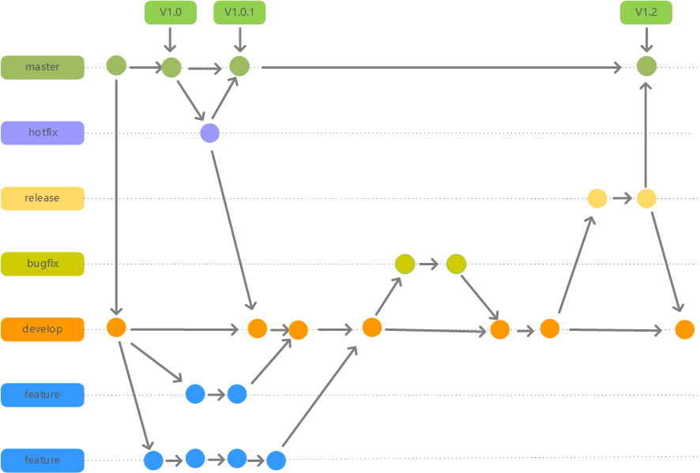

## git介绍

gitflow是构建在git之上的   一个组织软件开发活动的模型，是在git之上构建的一项软件开发最佳实践，并非什么技术，而是适合用来管理大型项目的开发和维护的源码管理模型工具。能够高效，更好，更规范的对项目源码进行管理。

### gitflow分支模型

### 分支介绍及使用场景

| 分支名称 | 分支特性                                                     |
| -------- | ------------------------------------------------------------ |
| master   | 名称：发布分支 是否受保护：是，不允许修改代码 范围：该版本包含所有已发布的各系统各版本的源代码 创建：git初始化时自动创建，有且只有一个，始终不能删除 更新：源代码更新是从release分支或hotfix分支合并来的，不建议主成直接修改master |
| develop  | 名称：开发主干分支 范围：包含以发布的各系统的源码以及系统版本功能集成测试的源代码，内容始终包含master分支内容 创建：基于master分支创建，有且只有一个，始终不能删除。可以派生出feature分支 更新：①源代码**禁止**在develop上进行修改；②可以由feature、bugfix、release、hotfix合并过来 |
| feature  | 名称：功能分支 范围：包含具体单一功能源代码 创建：基于develop分支创建，可以同时有多个分支，一旦开发完成，合并到develop后删除该分支 主要用途：用来完成单个可提测的功能开发 |
| bugfix   | 名称：功能集成测试缺陷分支 范围：主要包含本次发布版本测试针对功能集成测试的缺陷修复的源代码和已发布版本的源代码 创建：基于develop分支创建 主要用途：修改功能继承测试的缺陷 |
| release  | 名称：稳定测试分支 范围：包含已发布的功能的源代码和本次提测功能的源代码 创建：基于develop分支创建，同一时间同一系统同一发布版本只能有一个分支。测试完成后合并到develop和master后删除 主要用途：主要用来修改稳定测试的缺陷，**发布包**从此分支打出 |
| hotfix   | 名称：补丁分支 范围：包含已发布的功能和正在修复缺陷的源代码 创建：基于master分支创建。修改功能后合并源代码至master和develop，上线删除该分支 主要用途：主要用来修改发布后缺陷，**补丁包**从此分支打出 |

理解：除了master分支为主分支外，所有其他分支均可以看成feature，只是创建的分支是根据使用场景，为其负责的职责不同，按照功能和创建的周期长短命名成不同的分支。

