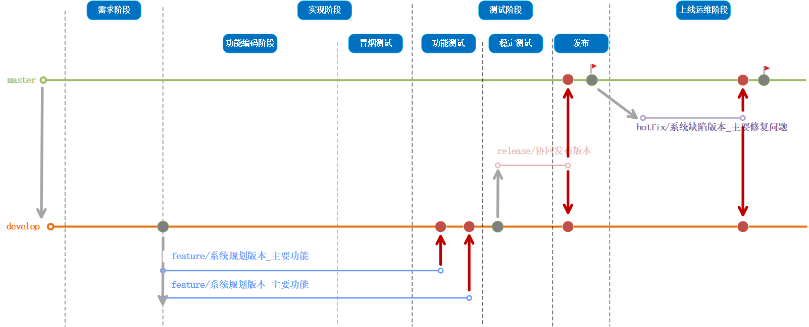

## 一、背景及目的

### （1）现状分析

在项目后期执行过程中，我本人发现重要系统发布都以文件替换的形式发布（不敢整体替换程序包）。主要原因是团队在使用git时并不规范，未形成规范的适合团队的git工作流，导致分支使用随便，源代码管理混乱。总结git使用问题如下

| 问           题 | 描述                                                         |
| --------------- | ------------------------------------------------------------ |
| 分支规划        | 在系统开发阶段，开发人员并未注重源码是在哪个分支上进行开发，有很多时候代码都开始改动了，才发现分支不对，将其修改的代码进行拷贝，还原本地分支后再切换分支或者重新创建分支，再拷贝代码 |
| 分支命名        | 分支命名有系统版本名称的，有纯英文的，也有单是一个版本号的... 分支命名应该见明知意 |
| 分支使用        | 自定义master分支：一个git下存放多个系统的源码，且master受保护，代码提交受阻。协同页面拉出一个自己的develop分支作为maser进行开发了，发布后的源码也不往master分支合并了，需要发布补丁版本也是直接从，develop上直接拉分支 |
| 分支合并        | 开人员测试时都是自己本地环境打包，测试完成后也不注重代码合并，导致自己开发的功能就在自己的分支上放着，但master分支并未包含该功能的代码，导致该功能上线，项目重新发布，从master构建出来的程序包就会缺失功能 分析主要两点原因： ①分支合并master需要提交和并请求，并没有指定提交给谁，自己又合并布上去 ②先完成其他工作，合并分支简单，只要分支在源码就在，什么时间合并都行 |
| 分支删除        | 开发人员在合并分支的时候潜意识给你自留有余地，合并后不删除原有分支，出现缺陷后好快速找到代码，但造成git分支过多，文件夹越来越大 |
| tag创建         | ①在版本发布后，开发人员或者开发负责人没有意识去创建tag； ②创建tag的命名方式较乱，有全是英文的，全是汉字的，英文+字符的，从名字上并不能快速获取有用的信息 |

### （2）目标

针对以上出现的问题，编写《版本研发过程中git使用规范》来规范团队中开发人员对git的使用，从而约束成一种习惯，在团队内部逐渐形成适合团队开发人员开展工作的git工作流

使用范围：**适用于项目各系统各研发(如有特殊情况无法遵守，需要申请）**

参考资料：不熟悉gitflow模型的开发人员可参考《gitflow介绍篇》进行简单了解

## 二、分支管理规范

本篇主要以项目版本迭代开发为主要载体，在研发流程各阶段中概述git各分支的创建、合并、删除等操作，规范分支管理

### （1）项目创建阶段

在项目创建阶段，先确定研发经理，需要研发经理先申请git，先简单介绍一下gitlab中的5中角色，及各角色对应的权限

| 角色       | 权限                                                         | 对应人员                     |
| ---------- | ------------------------------------------------------------ | ---------------------------- |
| guest      | 可以创建issue、发表评论，不能读写版本库                      |                              |
| report     | 可以克隆源代码，但不能提交                                   | 项目经理                     |
| develop    | 可以克隆源代码、进行开发、提交、推送非保护分支到中央仓库；可以自行创建分支；创建tag标签等权限 | 开发人员                     |
| maintainer | 创建项目、添加tag、设置保护分支、添加项目成员、编辑项目，同意分支合并 | 研发经理/系统负责人/主程序员 |
| owner      | 可以设置项目访问权限、删除项目、迁移项目、管理组成员         | 配置管理员                   |

#### 	git仓库申请（创建）

1. 申请时间：项目立项后，开始上传文件或者编码之前

2. 申请人：研发经理/研发负责人

3. 申请操作：

   - 第一步：确定项目需要git个数：在项目前期，根据项目的规模、系统的数量、系统间的关联性、复杂度等综合确定git资源申请数量。项目源代码git和项目文档git分开使用

     建议：(1)小项目尽量所有系统的源代码放一个仓库，方便统一管理

     ​			(2)大项目可根据各系统之间的关联性复杂度和系统规模划分多个git进行管理

   - 第二步：提交git申请：git资源的申请由研发经理或者研发负责人向配置管理组人员提供项目有关信息进行申请

   - 第三步：获取git地址：提交申请后，配置管理员按照要求创建好git之后会反馈初始化（**master分支此时创建**）后的git访问地址

注：负责政法委开发部配置管理人是**肖飒**

#### 	git成员加入

1. 申请人：研发相关人员
2. 审批人：研发经理/研发负责人
3. 申请加入操作：
   - 第一步：由申请者向主成人员或者负责人（拥有maintainer角色的人）进行申请加入git资源
   - 第二步：研发经理或者负责人在人员在Settings->Members中搜索账号或域名设置角色并添加后通知申请人

#### 	develop分支创建

在初始化后，可基于master分支创建一个新的分支，名称为develop分支，需要进行如下步骤（**注：此过程一般由研发经理或者系统负责人进行**）

1. 创建时间：从配置管理组申请到git地址后，即master分支初始化成功之后，编写源代码之前
2. 创建人：研发经理/研发负责人
3. 操作步骤：
   - 第一步：将master分支设置为受保护分支，不允许开发人员提交代码。可以进入Settings->Repository->Protected branches进行管
   - 第二步：查看当前分支，确认当前分支是master
   - 第三步：创建develop分支。git checkout -b develop

### （2）项目执行阶段

在项目迭代版本开始执行阶段先明确系统的开发负责人（主程序员），以方便各分支的创建以及删除，下图展示git分支在研发管理各阶段的生命周期展示

#### 	feature创建

1. 创建时间：在版本迭代需求明确之后，开始编码之前

2. 创建人：开发负责人（主程序员）

3. 操作步骤：

   - 第一步：切换本地分支至develop上，拉取最新代码

   - 第二步：按照功能耦合度，测试人员及测试时间安排，合理创建版本（功能）分支

     **注：新建分支统一命名规则：feature/系统规划版本_主要功能特性**

     例如：将运维消息，数据库升级等内容规划在智能消息系统系统V1.2版本中实现，新建分支名称为：feature/智能消息系统V1.2_运维消息

   - 第三步：切换至新创建的功能分支，新分支名称告知版本迭代相关人员

   - 第四步：配置公司自动化构建平台，在提测前关闭自动构建（提测环境的程序包必须由服务器构建，禁止本地环境构建）

     地址：**[http://jenkins.thunisoft.com/](http://jenkins.thunisoft.com/)**

#### 	feature合并

1. 合并时间：需要合并的分支上功能已完成初测，并且初测问题已修改完成之后，准备进入稳定测试之前（未经过初测完成禁止合并）
2. 合并人：开发人员（多人一分支，任选一开发人员）
3. 具体操作：
   - 第一步：合并分支至develop上
   - 第二步：解决合并冲突，记录解决冲突的代码部分。**分析影响的系统功能，并提交系统负责人**
   - 第三步：合并成功之后，删除迭代版本功能分支

#### release创建

1. 创建时间：在版本（功能）分支合并到develop上之后，准备稳定程序包测试之前

2. 创建人：开发负责人

3. 具体操作：

   - 第一步：切换本地分支至develop上，更新develop上最新源代码

   - 第二步：确认迭代版本中的规划的发布内容已合并至develop上

   - 第三步：创建release分支

     **注：统一命名规则：release/系统发布版本名称**

     例如：release/智能消息系统V1.2

   - 第四步：修改自动构建的分支。例如：将jenkins配置中的分支值修改为智能消息系统V1.2（程序包由此构建）

     **注：提交稳定包，将合并代码冲突影响的功能提供测试人员**

#### release合并

1. 合并时间：在稳定版测试完成之后，即收到发布邮件之后
2. 合并人：开发人员（多人则选择稳定版代码改动较多的人员）
3. 具体操作：
   - 第一步：合并代码至develop上
   - 第二步：合并代码到master上，需要在网页提交和并请求，经过系统负责人（主程序员）审查代码后，进行分支合并
   - 第三步：develop上和master均合并成功后，删除该分支

#### tag创建

1. 创建时间：在版本发布后，且代码合并到master上之后

2. 创建人：开发负责人

3. 具体操作：

   - 第一步：网页访问git资源跟目录，Repository->Tags->New tag

   - 第二步：选择master分支（不是master分支修改至master分支）

   - 第三步：填写tag名字及相关发布版本信息，点击创建。

     **注：统一命名规则为【系统版本发布名称】（和邮件上发布名称一致）**

     **发布信息里填写发布邮件中的发布内容**

### （3）项目运维阶段

#### hotfix创建

例如：在V1.2版本中发现业务消息查询结果返回的消息发送日期列数据全部显示为空。已规划在智能消息系统V1.2.1中修复

1. 创建时间：在系统交付之后，线上反馈的功能缺陷，研发V经理规划解决版本之后

2. 创建人：开发人员

3. 具体操作：

   - 第一步：切换本地分支至master分支，更新本地源代码至最新

   - 第二步：确认缺陷发布的程序包是哪个版本，寻找对应的tag标签

   - 第三步：本地回归master到指定的tag版本

   - 第四步：创建hotfix分支。

     **注：统一命名规则：hotfix/规划解决版本号_缺陷描述**

     例如：hotfix/智能消息系统V1.2.1_日期显示为空

#### hotfix合并

1. 合并时间：经测试回归测试后，收到发布邮件之后
2. 合并人：开发人员
3. 具体操作：
   - 第一步：合并代码至develop上
   - 第二步：合并代码到master上，需要在网页提交和并请求，经过系统负责人（主程序员）审查代码后，进行分支合并
   - 第三步：develop上和master均合并成功后，删除该分支

#### tag创建

略，详见（2）项目执行阶段中的tag创建

 

------

